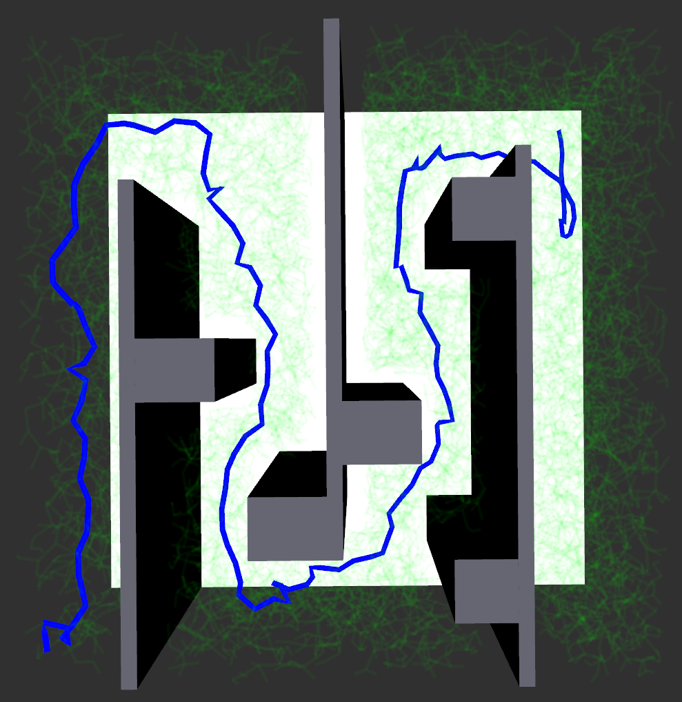
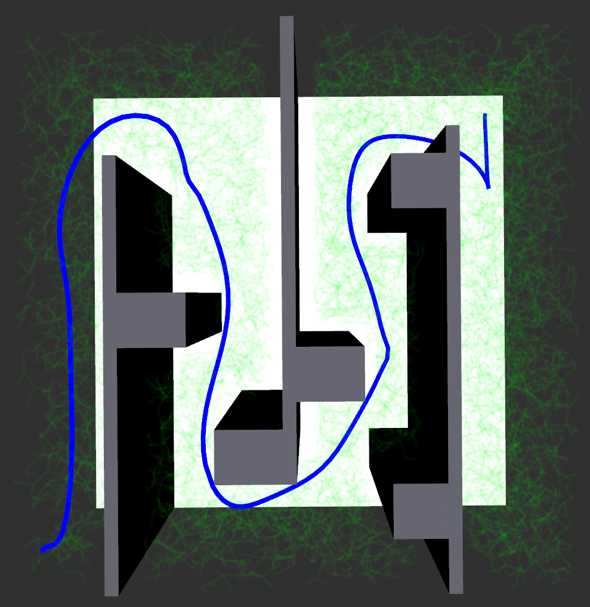
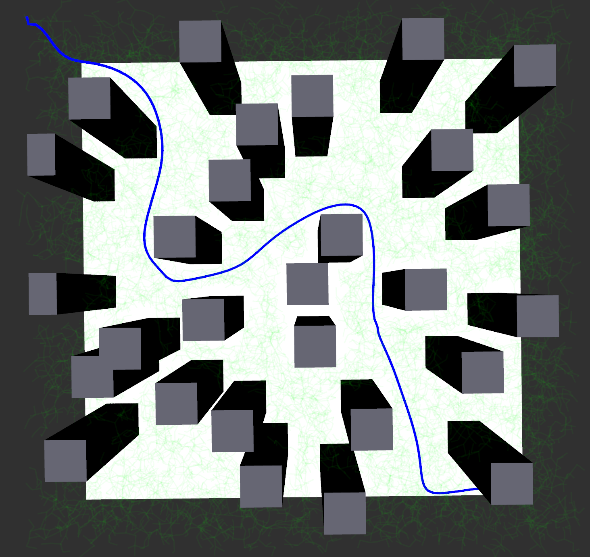
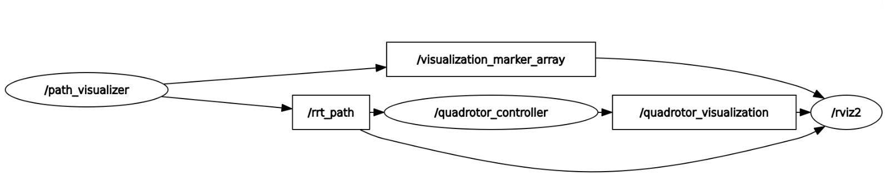

# Sampling-Based Motion Planning for Quadrotors in Cluttered Environments 

<p align="center">
  
</p>

This repository provides a comprehensive motion planning and control framework in C++ designed for quadrotor navigation in complex environments with obstacles. The system integrates three key components:

1. Path Planning: Implements the Rapidly-exploring Random Tree (RRT) algorithm, a probabilistic sampling-based approach that efficiently explores the configuration space to find collision-free paths. The generated paths are post-processed using De Casteljau's algorithm to create Bézier curves to ensure smooth trajectories that respect the quadrotor's dynamics.

2. Trajectory Control: Offers two controller implementations:
   - A nonlinear PD controller 
   - A model predictive control (MPC) based controller that optimizes the trajectory by considering future states (to be updated)

3. Visualization & Integration: Built on ROS2 middleware with full visualization support through rviz2, where we visualize:

   - the RRT exploration tree
   - Smoothed Bézier trajectories
   - Controller performance metrics
   - Obstacle map and collision boundaries

# Installation

Before beginning the installation, please ensure you have the following:
   - Ubuntu 22.04 or later
   - Git: `sudo apt-get install git`
   - ROS 2 Humble (installation instructions: [ROS 2 Documentation](https://docs.ros.org/en/humble/Installation.html)) (required only for standard installation)

## Docker Installation (recommended)

Firstly, install Docker. Installation instructions below are summarized from [Install Docker Engine on Ubuntu](https://docs.docker.com/engine/install/ubuntu/). If you have Docker installed, please skip to step 1.
```bash
# 0. Install Docker:
# Add Docker's official GPG key:
sudo apt-get update
sudo apt-get install ca-certificates curl
sudo install -m 0755 -d /etc/apt/keyrings
sudo curl -fsSL https://download.docker.com/linux/ubuntu/gpg -o /etc/apt/keyrings/docker.asc
sudo chmod a+r /etc/apt/keyrings/docker.asc

# Add the repository to Apt sources:
echo \
  "deb [arch=$(dpkg --print-architecture) signed-by=/etc/apt/keyrings/docker.asc] https://download.docker.com/linux/ubuntu \
  $(. /etc/os-release && echo "$VERSION_CODENAME") stable" | \
  sudo tee /etc/apt/sources.list.d/docker.list > /dev/null

sudo apt-get update

# To install the latest version:
sudo apt-get install docker-ce docker-ce-cli containerd.io docker-buildx-plugin docker-compose-plugin

# Verify Docker installation:
sudo docker run hello-world
```

Start here if you have Docker installed:
```bash
# 1. Clone repository:
git clone https://github.com/mayank176/RRT_planner.git
cd RRT_planner

# 2. Build Docker image:
docker build -t rrt_planner .

# 3. Enable GUI applications (Rviz2):
xhost +local:docker

# 4. Run container:
docker run -it \
    --network=host \
    --env="DISPLAY" \
    --env="QT_X11_NO_MITSHM=1" \
    --volume="/tmp/.X11-unix:/tmp/.X11-unix:rw" \
    rrt_planner

# 5. Verify install (inside the Docker container):
ros2 launch rrt_vis rrt_planner.launch.py
```

## Standard Installation

```bash
# 1. Create a ROS2 workspace:
mkdir -p ~/RRT_planner
cd ~/RRT_planner

# 2. Clone the repository:
git clone https://github.com/mayank176/RRT_planner.git

# 3. Install dependancies:
sudo apt update
sudo apt install -y \
    python3-pip \
    python3-rosdep \
    python3-colcon-common-extensions \
    libeigen3-dev
sudo rosdep init
rosdep update
rosdep install --from-paths src --ignore-src -r -y

# 4. Build package:
cd ~/RRT_planner
colcon build
source ~/RRT_planner/install/setup.bash
```

# Configuration Options

Access to all environment, RRT, and controller parameters listed below can be configured in `RRT_planner/src/rrt_vis/config/rrt_params.yaml` 

<p align="center">
  
  &nbsp;&nbsp;&nbsp;
  
  &nbsp;&nbsp;&nbsp;
  
  &nbsp;&nbsp;&nbsp;
  
</p>
<p align="center">
  <em>Env 1</em>&nbsp;&nbsp;&nbsp;&nbsp;&nbsp;&nbsp;&nbsp;&nbsp;&nbsp;&nbsp;&nbsp;&nbsp;&nbsp;&nbsp;&nbsp;&nbsp;&nbsp;&nbsp;&nbsp;&nbsp;&nbsp;&nbsp;&nbsp;&nbsp;&nbsp;&nbsp;&nbsp;&nbsp;&nbsp;&nbsp;&nbsp;&nbsp;&nbsp;&nbsp;&nbsp;&nbsp;&nbsp;&nbsp;&nbsp;&nbsp;&nbsp;&nbsp;&nbsp;&nbsp;&nbsp;&nbsp;&nbsp;
  <em>Env 2</em>&nbsp;&nbsp;&nbsp;&nbsp;&nbsp;&nbsp;&nbsp;&nbsp;&nbsp;&nbsp;&nbsp;&nbsp;&nbsp;&nbsp;&nbsp;&nbsp;&nbsp;&nbsp;&nbsp;&nbsp;&nbsp;&nbsp;&nbsp;&nbsp;&nbsp;&nbsp;&nbsp;&nbsp;&nbsp;&nbsp;&nbsp;&nbsp;&nbsp;&nbsp;&nbsp;&nbsp;&nbsp;&nbsp;&nbsp;&nbsp;&nbsp;&nbsp;&nbsp;&nbsp;&nbsp;&nbsp;&nbsp;&nbsp;&nbsp;&nbsp;&nbsp;&nbsp;&nbsp;&nbsp;&nbsp;&nbsp;
  <em>Env 3</em>
  &nbsp;&nbsp;&nbsp;&nbsp;&nbsp;&nbsp;&nbsp;&nbsp;&nbsp;&nbsp;&nbsp;&nbsp;&nbsp;&nbsp;&nbsp;&nbsp;&nbsp;&nbsp;&nbsp;&nbsp;&nbsp;&nbsp;&nbsp;&nbsp;&nbsp;&nbsp;&nbsp;&nbsp;&nbsp;&nbsp;&nbsp;&nbsp;&nbsp;&nbsp;&nbsp;&nbsp;&nbsp;&nbsp;&nbsp;&nbsp;&nbsp;&nbsp;&nbsp;&nbsp;&nbsp;&nbsp;&nbsp;&nbsp;&nbsp;&nbsp;&nbsp;&nbsp;&nbsp;&nbsp;&nbsp;&nbsp;
  <em>Env 4</em>
</p>

1. Environment Parameters:
   - `int environment_num`: Choose from 4 defined environments shown above to perform simulation (default: 3). 

   Note: change .yaml file to `rrt_params_env4.yaml` in `rrt_vis/launch/rrt_planner.launch.py` to load Env4 parameters.
   - `double min_bound_x, min_bound_y, min_bound_z`: If making a custom enviroment, choose minimum bounds of enviroment,  (default: -10.0,-10.0,-10.0 [m])
   - `double max_bound_x, max_bound_y, max_bound_z`: If making a custom enviroment, choose maximum bounds of enviroment (default: 11.0, 11.0, 11.0 [m])

2. RRT Parameters:
   - `double start_x, start_y, start_z`: Choose starting position of path (default: -9.0, -9.0, -9.0 [m])
   - `double goal_x, goal_y, goal_z`: Set the desired goal position of path (default: 10.0, 10.0, 10.0 [m])
   - `double step_size`: Control the granularity of the RRT tree expansion (default: 0.75 [m])
   - `double safety_margin`: Add a margin for collision checking (default: 0.7 [m]) 
   - `int max_iterations`: Maximum number of iterations for pathfinding (default: 10000) 

3. Controller Parameters
   - `int control_frequency`: Controller update rate (default: 100 [Hz])
   - `double simulation_time`: Choose total simulation time to generate feasible waypoints for controller (default: 25.0 [s])
   - `double Kp, Kd, Kr, Kw` : PD gains for lateral and altitude control
   - `int N`: Prediction horizon for MPC (default: 20 [steps])

Note: To create a custom environment you can modify obstacles in `RRT_planner/src/rrt_vis/src/rrt_vis.cpp`


# Usage

After configuring, simply run the following launch file to start the RRT planner, controller, and visualization in rviz2:

```C++
ros2 launch rrt_vis rrt_planner.launch.py
```
### Visualizing Bezier Smoothing of RRT Path with De Casteljau's algorithm

<p align="center">
  
  &nbsp;&nbsp;&nbsp;
  
</p>

<p align="center">
  
  &nbsp;&nbsp;&nbsp;
  
</p>


# Workspace Structure and Node Communication

The RRT planner system consists of three main ROS2 packages that work together to plan and visualize paths for a quadrotor. We explain this below:

### Path Visualization (`rrt_vis`)
The `/path_visualizer` node, implemented in `rrt_vis/src/rrt_vis.cpp`, manages the visualization of paths and environments. It publishes to two topics:
- `/rrt_path`: Contains the computed RRT (Rapidly-exploring Random Tree) path data
- `/visualization_marker_array`: Carries visualization markers that represent the environment, RRT path, and the exploration tree

### Quadrotor Control (`mpc`)
The `/quadrotor_controller` node, found in `mpc/src/sim.cpp`, handles the quadrotor's movement. It:
1. Subscribes to the `/rrt_path` topic to receive planned paths
2. Processes this data using the selected controller
3. Computes the quadrotor's trajectory based on its dynamics

### Visualization
The `rviz2` node brings everything together visually by subscribing to:
- `/visualization_marker_array`: Shows the environment, paths, and tree structure
- `/quadrotor_visualization`: Displays the quadrotor's movement

## System Architecture
The following rqt graph illustrates how these components communicate:

<p align="center">
  
</p>

## Package Structure
```
RRT_planner/
├── src/
    ├── rrt/                          # Core RRT Implementation
    │   ├── include/
    |   |   └── rrt.h
    │   ├── src/
    |   |   └── main.cpp    
    │   ├── CMakeLists.txt
    │   └── package.xml
    │
    ├── rrt_vis/                      # Visualization Package
    │   ├── include/
    |   |   └── rrt_vis.h
    │   ├── src/
    |   |   ├── rrt_vis.cpp           # Visualize and Run RRT Implementation
    |   |   └── main.cpp
    │   ├── config/           
    │   │   └── rrt_params.yaml       # Configuration for RRT, Controller and Simulation
    │   ├── launch/
    │   │   └── rrt_planner.launch.py # Launch File for Complete Project
    │   ├── CMakeLists.txt
    │   └── package.xml
    │
    └── mpc/                          # Control and Simulation Package
        ├── include/
        |   ├── controls.h
        |   ├── quadrotor.h
        |   ├── sim.h
        |   └── utils.h
        ├── src/
        |   ├── controls.cpp          # Controller Implementations
        |   ├── quadrotor.cpp         # Quadrotor Dynamics
        |   ├── sim.cpp               # Simulation Environment
        |   └── main.cpp
        ├── CMakeLists.txt
        └── package.xml
```

# Troubleshooting

Common issues and solutions:
1. Rviz2 visualization: Ensure correct path to rviz config file in launch file


# License

[MIT](https://choosealicense.com/licenses/mit/)